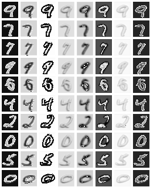

# GloRe
PyTorch implementation of Global Reasoning unit (GloRe) unit from [Graph-Based Global Reasoning Networks](https://research.fb.com/wp-content/uploads/2019/05/Graph-Based-Global-Reasoning-Networks.pdf?).

Visualization of B matrix for some MNIST examples, columns correspond to N different features:

